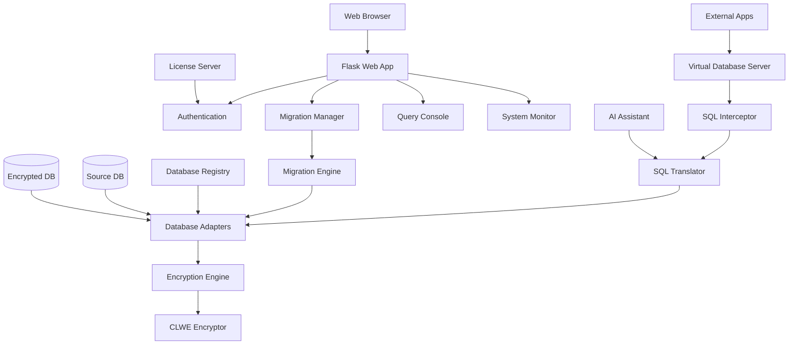

# Architecture Overview

## System Components

CryptoPIX Bridge consists of several key components that work together to provide transparent database encryption.

### Core Components

1. **Web Application (Flask)**
   - User interface for configuration and management
   - REST API for programmatic access
   - Authentication and authorization

2. **Database Adapters**
   - Support for multiple database types (MySQL, PostgreSQL, SQLite, etc.)
   - Unified interface for database operations

3. **Encryption Engine (CLWE)**
   - Column-level encryption/decryption
   - Secure key management
   - Configurable security levels

4. **SQL Translator**
   - Automatic query translation for encrypted data
   - AI-powered query assistance
   - Natural language to SQL conversion

5. **Virtual Database Server (VDS)**
   - Transparent proxy server
   - Real-time encryption/decryption
   - Connection pooling

6. **Migration Engine**
   - Bulk data migration
   - Schema transformation
   - Progress tracking

### Architecture Diagram

### Data Flow

1. **Migration Phase**
   - Source data is read from original database
   - Sensitive columns are encrypted using CLWE
   - Encrypted data is written to target database
   - Schema is updated with encryption metadata

2. **Runtime Phase**
   - Applications connect to VDS instead of direct database
   - VDS intercepts SQL queries
   - SQL Translator modifies queries for encrypted columns
   - Encryption Engine handles data transformation
   - Results are decrypted before returning to application

### Security Architecture

- **Encryption at Rest**: Data encrypted in database using CLWE
- **Encryption in Transit**: Optional TLS for VDS connections
- **Key Management**: Password-based encryption with rotation support
- **Access Control**: License-based authentication
- **Audit Logging**: Comprehensive system logging

### Performance Considerations

- **Lazy Decryption**: Only decrypt data when needed
- **Connection Pooling**: Efficient database connections
- **Query Optimization**: AI-assisted query optimization
- **Caching**: Schema and metadata caching

### Scalability

- **Horizontal Scaling**: Multiple VDS instances
- **Database Sharding**: Support for sharded databases
- **Load Balancing**: Distributed query processing

## Deployment Options

### Single Server
- All components on one machine
- Suitable for small to medium deployments

### Distributed
- Web app and VDS on separate servers
- Database servers on dedicated hardware
- Load balancers for high availability

### Cloud Deployment
- Containerized components (Docker)
- Kubernetes orchestration
- Cloud database services integration

## Integration Points

- **Database Drivers**: Native drivers for each supported database
- **License Server**: External authentication service
- **Monitoring**: Integration with monitoring systems
- **Backup**: Integration with backup solutions

## Future Enhancements

- Multi-cloud support
- Advanced encryption algorithms
- Real-time replication
- Automated scaling
- Machine learning for data classification